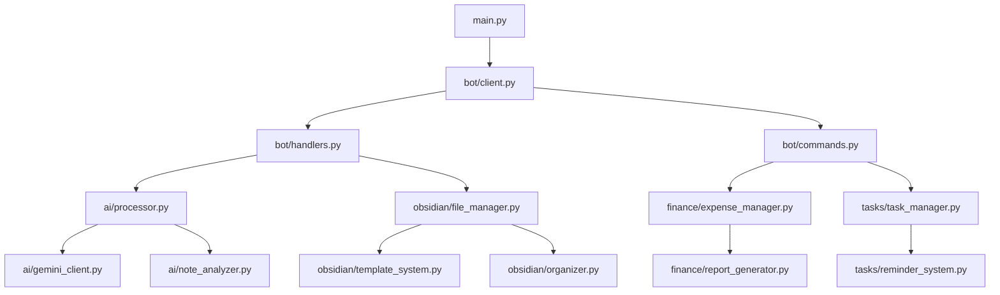

# システムアーキテクチャ

MindBridge のシステム設計思想、アーキテクチャパターン、モジュール構成について詳細に説明します。

## 目次

1. [設計思想](#設計思想)
2. [全体アーキテクチャ](#全体アーキテクチャ)
3. [レイヤードアーキテクチャ](#レイヤードアーキテクチャ)
4. [モジュール構成](#モジュール構成)
5. [データフロー](#データフロー)
6. [設計パターン](#設計パターン)
7. [非同期処理アーキテクチャ](#非同期処理アーキテクチャ)
8. [セキュリティアーキテクチャ](#セキュリティアーキテクチャ)

## 設計思想

### 核心原則

1. **非同期ファースト**: 全 I/O 操作を非同期で実装し、高いスループットを実現
2. **型安全性**: 完全な型ヒントによる安全性と IDE サポート
3. **単一責任**: 各モジュールは明確に定義された単一の責任を持つ
4. **疎結合**: 依存性注入による疎結合設計
5. **拡張性**: 新機能の追加が既存コードに影響しない設計

### 設計目標

- **保守性**: コードの理解・修正・拡張が容易
- **テスト可能性**: 包括的なテストが可能な設計
- **スケーラビリティ**: 負荷増加に対応可能
- **信頼性**: 高い可用性とエラー処理
- **セキュリティ**: 安全な認証情報管理

## 全体アーキテクチャ

### システム構成図

```
┌─────────────────────────────────────────────────────────────┐
│                    Client Layer                            │
│  ┌─────────────────┐  ┌──────────────────────────────────┐  │
│  │   Discord Bot   │  │      REST API (Future)          │  │
│  │   (Primary UI)  │  │   (Web Dashboard)                │  │
│  └─────────────────┘  └──────────────────────────────────┘  │
└─────────────────────────────────────────────────────────────┘
                               │
                               ▼
┌─────────────────────────────────────────────────────────────┐
│                  Application Layer                         │
│  ┌──────────────┐ ┌───────────────┐ ┌──────────────────┐   │
│  │ Message      │ │ Command       │ │ Event            │   │
│  │ Processing   │ │ Processing    │ │ Processing       │   │
│  └──────────────┘ └───────────────┘ └──────────────────┘   │
└─────────────────────────────────────────────────────────────┘
                               │
                               ▼
┌─────────────────────────────────────────────────────────────┐
│                  Business Logic Layer                      │
│  ┌──────────────┐ ┌───────────────┐ ┌──────────────────┐   │
│  │ AI           │ │ Finance       │ │ Task             │   │
│  │ Processing   │ │ Manager       │ │ Manager          │   │
│  └──────────────┘ └───────────────┘ └──────────────────┘   │
└─────────────────────────────────────────────────────────────┘
                               │
                               ▼
┌─────────────────────────────────────────────────────────────┐
│                   Integration Layer                        │
│  ┌─────────────┐ ┌──────────────┐ ┌──────────────────────┐  │
│  │ Gemini AI   │ │ Google Cloud │ │ Garmin Connect       │  │
│  │ API         │ │ Speech API   │ │ API                  │  │
│  └─────────────┘ └──────────────┘ └──────────────────────┘  │
└─────────────────────────────────────────────────────────────┘
                               │
                               ▼
┌─────────────────────────────────────────────────────────────┐
│                   Storage Layer                            │
│  ┌─────────────────────────┐  ┌─────────────────────────┐   │
│  │     Obsidian Vault      │  │   Security & Logs       │   │
│  │   (Structured Notes)    │  │ (Cloud Secret Manager)  │   │
│  └─────────────────────────┘  └─────────────────────────┘   │
└─────────────────────────────────────────────────────────────┘
```

### 主要コンポーネント

| コンポーネント | 責任 | 技術 |
|---------------|------|------|
| **Discord Client** | ユーザーインターフェース | discord.py |
| **AI Processor** | メッセージの分析・分類 | Google Gemini API |
| **Obsidian Manager** | ノート管理・保存 | aiofiles |
| **Task Manager** | タスク管理・追跡 | Pydantic モデル |
| **Finance Manager** | 家計管理・レポート | 独自実装 |
| **Security Manager** | 認証情報管理 | Google Secret Manager |

## レイヤードアーキテクチャ

### インターフェース層（プレゼンテーション）

**責任**: 外部システムとのインターフェース

```python
# src/bot/
├── client.py          # メイン Discord クライアント
├── handlers.py        # イベントハンドラー
├── commands.py        # スラッシュコマンド
├── message_processor.py # メッセージ処理ロジック
└── models.py          # Discord データモデル
```

**特徴:**
- Discord API との直接やり取り
- ユーザー入力の検証
- レスポンスフォーマット
- エラーハンドリング

### アプリケーション層（ユースケース）

**責任**: アプリケーション固有のビジネスルール

```python
# 主要ユースケース
class MessageProcessingUseCase:
    async def process_message(self, message: DiscordMessage) -> ProcessingResult

class TaskCreationUseCase:
    async def create_task_from_message(self, content: str) -> Task

class NoteGenerationUseCase:
    async def generate_structured_note(self, analysis: AIAnalysis) -> Note
```

### ドメイン層（ビジネスロジック）

**責任**: コアビジネスロジックとドメインルール

```python
# src/ai/, src/finance/, src/tasks/
├── ai/
│   ├── processor.py       # AI エンジン
│   ├── note_analyzer.py   # ノート分析
│   └── vector_store.py    # ベクトル検索
├── finance/
│   ├── expense_manager.py # 支出管理
│   └── report_generator.py # レポート生成
└── tasks/
    ├── task_manager.py    # タスク管理
    └── schedule_manager.py # スケジュール管理
```

### インフラストラクチャ層

**責任**: 技術的な詳細とデータアクセス

```python
# src/obsidian/, src/garmin/, src/audio/, src/security/
├── obsidian/              # Obsidian 統合
├── garmin/                # 外部 API 統合
├── audio/                 # 音声処理
├── security/              # セキュリティ
└── monitoring/            # 監視・ログ
```

## モジュール構成

### 詳細なディレクトリ構造

```
src/
├── bot/                    # Discord Bot レイヤー
│   ├── client.py          # 🤖 メイン Discord クライアント
│   ├── handlers.py        # 📨 イベントハンドラー
│   ├── commands/          # ⚡ コマンドモジュール
│   │   ├── basic_commands.py   # 基本コマンド
│   │   ├── config_commands.py  # 設定コマンド
│   │   ├── stats_commands.py   # 統計コマンド
│   │   ├── finance_commands.py # 金融管理コマンド
│   │   ├── task_commands.py    # タスク管理コマンド
│   │   └── integration_commands.py # 外部連携コマンド
│   ├── mixins/            # 🔄 再利用可能なミックスイン
│   │   └── command_base.py     # コマンドベースクラス
│   ├── message_processor.py # 🔄 メッセージ処理ロジック
│   ├── notification_system.py # 🔔 通知システム
│   ├── review_system.py   # 📝 レビューシステム
│   ├── channel_config.py  # 📺 チャンネル設定管理
│   ├── backup_system.py   # 💾 バックアップシステム
│   ├── config_manager.py  # ⚙️ 設定管理
│   ├── metrics.py         # 📊 ボットメトリクス・監視
│   ├── mock_client.py     # 🧪 モッククライアント
│   ├── models.py          # 📋 Discord データモデル
│   └── __init__.py
│
├── ai/                     # AI 処理レイヤー
│   ├── processor.py       # 🧠 メイン AI プロセッサー
│   ├── gemini_client.py   # 🔮 Gemini API クライアント
│   ├── note_analyzer.py   # 📝 ノート分析エンジン
│   ├── url_processor.py   # 🌐 URL 内容処理
│   ├── vector_store.py    # 🔍 ベクトル検索
│   ├── mock_processor.py  # 🧪 モックプロセッサー
│   ├── models.py          # 📊 AI データモデル
│   └── __init__.py
│
├── obsidian/              # Obsidian 統合レイヤー
│   ├── core/              # 🏗️ コア機能
│   │   ├── vault_manager.py    # ボルト管理
│   │   └── file_operations.py  # ファイル操作
│   ├── search/            # 🔍 検索機能
│   │   ├── note_search.py      # ノート検索
│   │   └── search_models.py    # 検索データモデル
│   ├── backup/            # 💾 バックアップ機能
│   │   ├── backup_manager.py   # バックアップ管理
│   │   └── backup_models.py    # バックアップデータモデル
│   ├── analytics/         # 📊 分析機能
│   │   ├── vault_statistics.py # ボルト統計
│   │   └── stats_models.py     # 統計データモデル
│   ├── template_system/   # 📄 高度なテンプレートエンジン
│   │   ├── base.py             # ベーステンプレートクラス
│   │   ├── engine.py           # テンプレートエンジン
│   │   ├── generator.py        # テンプレート生成器
│   │   ├── loader.py           # テンプレートローダー
│   │   ├── processor.py        # テンプレート処理器
│   │   ├── validator.py        # テンプレート検証
│   │   └── yaml_generator.py   # YAML フロントマター生成
│   ├── interfaces.py      # 📋 抽象インターフェース
│   ├── local_data_manager.py # 💾 ローカルデータ管理
│   ├── file_manager.py       # 📁 ファイル管理（本番名）
│   ├── daily_integration.py # 📅 デイリーノート統合
│   ├── organizer.py       # 🗂️ ボルト組織化
│   ├── github_sync.py     # 🔗 GitHub 同期
│   ├── github_direct.py   # 🔗 直接 GitHub 統合
│   ├── metadata.py        # 🏷️ メタデータ管理
│   ├── models.py          # 📋 Obsidian データモデル
│   └── __init__.py
│
├── finance/               # ファイナンス管理
│   ├── expense_manager.py # 💰 支出管理
│   ├── subscription_manager.py # 🔄 サブスク管理
│   ├── budget_manager.py  # 📊 予算管理
│   ├── report_generator.py # 📈 レポート生成
│   ├── reminder_system.py # ⏰ リマインダー
│   ├── message_handler.py # 📨 メッセージハンドラー
│   ├── commands.py        # ⚡ ファイナンスコマンド
│   ├── models.py          # 💳 金融データモデル
│   └── __init__.py
│
├── tasks/                 # タスク管理
│   ├── task_manager.py    # ✅ タスク管理
│   ├── schedule_manager.py # 📅 スケジュール管理
│   ├── reminder_system.py # 🔔 リマインダー
│   ├── report_generator.py # 📊 生産性レポート
│   ├── commands.py        # ⚡ タスクコマンド
│   ├── models.py          # 📝 タスクデータモデル
│   └── __init__.py
│
├── health_analysis/       # 健康データ分析
│   ├── analyzer.py        # 📊 データ分析
│   ├── integrator.py      # 🔗 データ統合
│   ├── scheduler.py       # ⏱️ 定期処理
│   ├── models.py          # 🏃 健康データモデル
│   └── __init__.py
│
├── garmin/                # Garmin Connect 統合
│   ├── client.py          # 🏃 Garmin API クライアント
│   ├── cache.py           # 💾 データキャッシュ
│   ├── formatter.py       # 📋 データフォーマット
│   ├── models.py          # 📊 Garmin データモデル
│   └── __init__.py
│
├── audio/                 # 音声処理
│   ├── speech_processor.py # 🎤 音声文字起こし
│   ├── models.py          # 🔊 音声データモデル
│   └── __init__.py
│
├── security/              # セキュリティ
│   ├── secret_manager.py  # 🔐 秘密情報管理
│   ├── access_logger.py   # 📝 アクセスログ
│   └── __init__.py
│
├── config/                # 設定管理
│   ├── settings.py        # ⚙️ アプリケーション設定
│   ├── secure_settings.py # 🔒 セキュア設定
│   └── __init__.py
│
├── lifelog/               # 包括的ライフトラッキングシステム
│   ├── integrations/      # 🔗 外部サービス統合
│   │   ├── base.py             # ベース統合クラス
│   │   ├── config.py           # 統合設定
│   │   ├── financial.py        # 金融データ統合
│   │   ├── garmin.py           # Garmin Connect 統合
│   │   ├── google_calendar.py  # Google Calendar 統合
│   │   ├── manager.py          # 統合マネージャー
│   │   ├── models.py           # 統合データモデル
│   │   └── scheduler.py        # 統合スケジューラー
│   ├── analyzer.py        # 📊 データ分析・トレンド検出
│   ├── commands.py        # ⚡ Discord ライフログコマンド
│   ├── manager.py         # 🏗️ コアライフログ管理
│   ├── message_handler.py # 📨 自動ライフログ検出
│   ├── models.py          # 📋 ライフログデータモデル
│   ├── templates.py       # 📄 Obsidian テンプレート
│   └── __init__.py
│
├── utils/                 # 共通ユーティリティ
│   ├── logger.py          # 📝 ログ設定
│   ├── mixins.py          # 🔄 共通ミックスイン
│   ├── mcp_client.py      # 🔌 MCP (Model Context Protocol) クライアント
│   ├── error_handler.py   # ❌ エラーハンドリング
│   └── __init__.py
│
├── monitoring/            # 監視・ヘルスチェック
│   ├── health_server.py   # 🏥 ヘルスチェックサーバー
│   └── __init__.py
│
└── main.py                # 🚀 アプリケーションエントリーポイント
```

### モジュール依存関係



## データフロー

### メッセージ処理フロー

```
1. Discord メッセージ入力
   ↓
2. メッセージハンドラー (bot/handlers.py)
   ↓
3. メッセージプロセッサー (bot/message_processor.py)
   ├── コンテンツ分析
   ├── チャンネルルーティング
   └── 権限チェック
   ↓
4. AI 処理 (ai/processor.py)
   ├── Gemini API 呼び出し
   ├── コンテンツ分類
   ├── タグ生成
   └── メタデータ抽出
   ↓
5. Obsidian 統合 (obsidian/file_manager.py)
   ├── テンプレート適用
   ├── フォルダ決定
   ├── ファイル生成
   └── メタデータ書き込み
   ↓
6. レスポンス生成
   ├── 成功通知
   ├── エラーハンドリング
   └── ユーザーフィードバック
```

### 音声処理フロー

```
1. 音声ファイルアップロード (Discord)
   ↓
2. 音声ハンドラー (bot/handlers.py)
   ↓
3. 音声プロセッサー (audio/speech_processor.py)
   ├── フォーマット検証
   ├── サイズチェック
   └── Google Speech API 呼び出し
   ↓
4. テキスト処理 (ai/processor.py)
   ├── 文字起こし分析
   ├── コンテンツ拡張
   └── メタデータ生成
   ↓
5. ノート生成 (obsidian/file_manager.py)
   ├── テンプレート適用
   ├── 音声ファイルリンク
   └── 構造化出力
```

## 設計パターン

### 1. 依存性注入パターン

```python
# 依存性注入の例
class MessageProcessor:
    def __init__(
        self,
        ai_processor: AIProcessor,
        obsidian_manager: ObsidianFileManager,
        config: Settings
    ):
        self.ai_processor = ai_processor
        self.obsidian_manager = obsidian_manager
        self.config = config

# ファクトリーパターンでの生成
def create_message_processor(settings: Settings) -> MessageProcessor:
    ai_processor = AIProcessor(settings.gemini_api_key)
    obsidian_manager = ObsidianFileManager(settings.obsidian_vault_path)
    return MessageProcessor(ai_processor, obsidian_manager, settings)
```

### 2. ストラテジーパターン

```python
# 処理戦略の切り替え
class ProcessingStrategy(ABC):
    @abstractmethod
    async def process(self, content: str) -> ProcessingResult:
        pass

class TextProcessingStrategy(ProcessingStrategy):
    async def process(self, content: str) -> ProcessingResult:
        # テキスト専用処理
        pass

class URLProcessingStrategy(ProcessingStrategy):
    async def process(self, content: str) -> ProcessingResult:
        # URL 専用処理
        pass

class MessageProcessor:
    def __init__(self):
        self.strategies = {
            'text': TextProcessingStrategy(),
            'url': URLProcessingStrategy(),
        }

    async def process(self, content: str, strategy_type: str):
        strategy = self.strategies[strategy_type]
        return await strategy.process(content)
```

### 3. オブザーバーパターン

```python
# イベント駆動アーキテクチャ
class EventPublisher:
    def __init__(self):
        self.subscribers: List[EventSubscriber] = []

    def subscribe(self, subscriber: EventSubscriber):
        self.subscribers.append(subscriber)

    async def publish(self, event: Event):
        for subscriber in self.subscribers:
            await subscriber.handle(event)

class FinanceEventSubscriber(EventSubscriber):
    async def handle(self, event: Event):
        if isinstance(event, ExpenseEvent):
            await self.process_expense(event)
```

### 4. テンプレートメソッドパターン

```python
# 共通処理フローの定義
class BaseProcessor(ABC):
    async def process(self, input_data: Any) -> ProcessingResult:
        # テンプレートメソッド
        validated_data = await self.validate(input_data)
        processed_data = await self.execute_processing(validated_data)
        result = await self.format_result(processed_data)
        await self.post_process(result)
        return result

    @abstractmethod
    async def execute_processing(self, data: Any) -> Any:
        pass

    async def validate(self, data: Any) -> Any:
        # デフォルト実装
        return data

    async def format_result(self, data: Any) -> ProcessingResult:
        # デフォルト実装
        return ProcessingResult(data)

    async def post_process(self, result: ProcessingResult):
        # デフォルト実装（ログ出力など）
        pass
```

## 非同期処理アーキテクチャ

### asyncio 基盤設計

```python
# メインイベントループ
async def main():
    # 非同期コンテキストマネージャー
    async with create_application_context() as app:
        # 複数のサービスを並行実行
        await asyncio.gather(
            app.discord_client.start(),
            app.health_server.start(),
            app.background_tasks.start(),
            return_exceptions=True
        )

# 非同期ファクトリー
async def create_application_context() -> AsyncContextManager:
    settings = get_settings()

    # 非同期クライアントの初期化
    async with aiohttp.ClientSession() as http_session:
        ai_processor = AIProcessor(settings, http_session)
        obsidian_manager = ObsidianFileManager(settings)

        yield ApplicationContext(
            ai_processor=ai_processor,
            obsidian_manager=obsidian_manager,
            settings=settings
        )
```

### 並行処理制御

```python
# セマフォによる並行数制御
class AIProcessor:
    def __init__(self, settings: Settings):
        self.semaphore = asyncio.Semaphore(settings.max_concurrent_ai_requests)
        self.rate_limiter = RateLimiter(
            max_requests=settings.gemini_api_minute_limit,
            time_window=60
        )

    async def process_batch(self, texts: List[str]) -> List[ProcessingResult]:
        tasks = [
            self._process_with_limits(text)
            for text in texts
        ]
        return await asyncio.gather(*tasks, return_exceptions=True)

    async def _process_with_limits(self, text: str) -> ProcessingResult:
        async with self.semaphore:
            await self.rate_limiter.acquire()
            return await self._process_text(text)
```

### エラーハンドリング戦略

```python
# 包括的エラーハンドリング
class RobustProcessor:
    async def process_with_retry(
        self,
        func: Callable,
        *args,
        max_retries: int = 3,
        backoff_factor: float = 1.5
    ) -> Any:
        for attempt in range(max_retries + 1):
            try:
                return await func(*args)
            except RetryableError as e:
                if attempt == max_retries:
                    raise

                wait_time = backoff_factor ** attempt
                logger.warning(
                    f"Attempt {attempt + 1} failed, retrying in {wait_time}s",
                    error=str(e)
                )
                await asyncio.sleep(wait_time)
            except FatalError:
                # 致命的エラーは即座に失敗
                raise
```

## セキュリティアーキテクチャ

### 多層防御戦略

```python
# 1. 認証情報の安全な管理
class SecretManager:
    async def get_secret(self, secret_name: str) -> str:
        if self.use_cloud_secret_manager:
            return await self._get_from_cloud(secret_name)
        else:
            return await self._get_from_env(secret_name)

    async def _get_from_cloud(self, secret_name: str) -> str:
        # Google Cloud Secret Manager
        client = secretmanager.SecretManagerServiceAsyncClient()
        name = f"projects/{self.project_id}/secrets/{secret_name}/versions/latest"
        response = await client.access_secret_version(request={"name": name})
        return response.payload.data.decode("UTF-8")

# 2. アクセスログ
class AccessLogger:
    async def log_access(
        self,
        user_id: str,
        action: str,
        resource: str,
        success: bool
    ):
        log_entry = {
            "timestamp": datetime.utcnow().isoformat(),
            "user_id": user_id,
            "action": action,
            "resource": resource,
            "success": success,
            "ip_address": await self._get_client_ip()
        }
        await self._write_security_log(log_entry)

# 3. 入力検証
class InputValidator:
    @staticmethod
    def validate_discord_message(message: str) -> str:
        # サニタイゼーション
        sanitized = html.escape(message)

        # 長さ制限
        if len(sanitized) > MAX_MESSAGE_LENGTH:
            raise ValidationError("Message too long")

        # 危険なパターンチェック
        if DANGEROUS_PATTERN.search(sanitized):
            raise SecurityError("Potentially dangerous content detected")

        return sanitized
```

### データ暗号化

```python
# 機密データの暗号化
class DataEncryption:
    def __init__(self, encryption_key: bytes):
        self.cipher_suite = Fernet(encryption_key)

    def encrypt_sensitive_data(self, data: str) -> str:
        encrypted_data = self.cipher_suite.encrypt(data.encode())
        return base64.b64encode(encrypted_data).decode()

    def decrypt_sensitive_data(self, encrypted_data: str) -> str:
        decoded_data = base64.b64decode(encrypted_data.encode())
        decrypted_data = self.cipher_suite.decrypt(decoded_data)
        return decrypted_data.decode()
```

## パフォーマンス考慮事項

### キャッシュ戦略

```python
# LRU キャッシュによる最適化
class CacheManager:
    def __init__(self, max_size: int = 1000):
        self.cache: OrderedDict = OrderedDict()
        self.max_size = max_size

    async def get_or_compute(
        self,
        key: str,
        compute_func: Callable,
        ttl: int = 3600
    ) -> Any:
        # キャッシュヒット
        if key in self.cache:
            entry = self.cache[key]
            if entry['expires'] > time.time():
                self.cache.move_to_end(key)  # LRU 更新
                return entry['value']
            else:
                del self.cache[key]  # 期限切れエントリ削除

        # キャッシュミス
        value = await compute_func()
        self._add_to_cache(key, value, ttl)
        return value
```

### リソース管理

```python
# コネクションプールの管理
class ResourceManager:
    def __init__(self):
        self.connection_pools = {}
        self.resource_limits = {
            'max_connections': 100,
            'connection_timeout': 30,
            'pool_recycle': 3600
        }

    async def get_connection(self, service: str) -> Connection:
        if service not in self.connection_pools:
            self.connection_pools[service] = await self._create_pool(service)

        pool = self.connection_pools[service]
        return await pool.acquire()

    async def cleanup(self):
        for pool in self.connection_pools.values():
            await pool.close()
```

## 拡張性設計

### プラグインアーキテクチャ

```python
# プラグイン基盤
class PluginManager:
    def __init__(self):
        self.plugins: Dict[str, Plugin] = {}
        self.hooks: Dict[str, List[Callable]] = defaultdict(list)

    def register_plugin(self, plugin: Plugin):
        self.plugins[plugin.name] = plugin
        plugin.register_hooks(self.hooks)

    async def execute_hook(self, hook_name: str, *args, **kwargs):
        for hook_func in self.hooks[hook_name]:
            await hook_func(*args, **kwargs)

# プラグイン例
class CustomProcessorPlugin(Plugin):
    name = "custom_processor"

    def register_hooks(self, hooks: Dict[str, List[Callable]]):
        hooks['before_ai_processing'].append(self.preprocess)
        hooks['after_obsidian_save'].append(self.postprocess)

    async def preprocess(self, content: str) -> str:
        # カスタム前処理
        return enhanced_content

    async def postprocess(self, result: SaveResult):
        # カスタム後処理
        pass
```

この包括的なアーキテクチャにより、 MindBridge は高い保守性、拡張性、信頼性を実現しています。各レイヤーの明確な責任分離により、新機能の追加や既存機能の修正が容易になっています。
