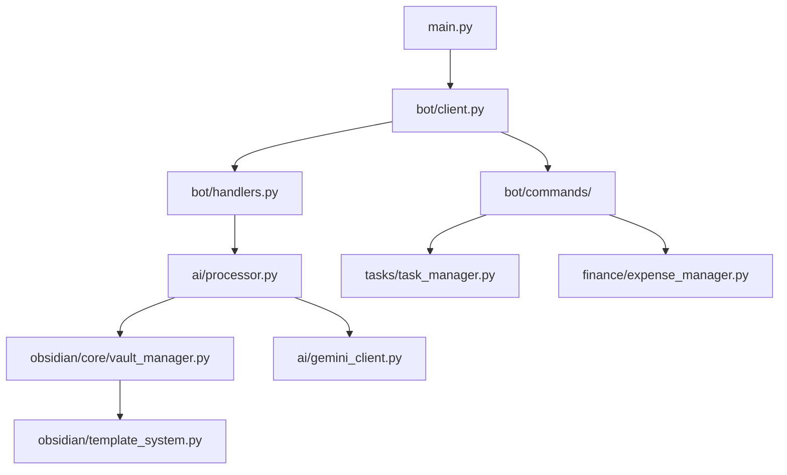

# 開発ガイド

環境セットアップから実装まで、 MindBridge 開発の包括的ガイド。

## 🔎 クイックリファレンス

```bash
# セットアップ
uv sync --dev

# 実行
uv run python -m src.main

# テスト / カバレッジ
uv run pytest -q
uv run pytest --cov=src --cov-report=term-missing

# 品質
uv run ruff check . --fix && uv run ruff format .
uv run mypy src

# フック
uv run pre-commit run --all-files
```

## 目次

1. [開発環境セットアップ](#開発環境セットアップ)
2. [プロジェクト構造](#プロジェクト構造)
3. [開発ワークフロー](#開発ワークフロー)
4. [コードスタイルとガイドライン](#コードスタイルとガイドライン)
5. [テスト戦略](#テスト戦略)
6. [デバッグ技術](#デバッグ技術)
7. [新機能開発](#新機能開発)
8. [パフォーマンス最適化](#パフォーマンス最適化)

## 🚀 開発環境セットアップ

### 必要ツール

```bash
# 必須ツール
python --version          # 3.13+
uv --version              # 最新版
git --version             # 2.20+
docker --version          # 20.10+ (オプション)

# 推奨ツール
code --version            # VS Code
curl --version            # HTTP テスト
jq --version              # JSON 処理
```

### 環境セットアップ

```bash
git clone https://github.com/kenvexar/mindbridge.git
cd mindbridge
uv sync --dev
cp .env.example .env.development
```

### VS Code 設定

`.vscode/settings.json`:
```json
{
    "python.pythonPath": "./.venv/bin/python",
    "python.linting.enabled": true,
    "python.linting.ruffEnabled": true,
    "python.formatting.provider": "ruff",
    "python.testing.pytestEnabled": true,
    "python.testing.pytestArgs": ["tests/"],
    "python.testing.autoTestDiscoverOnSaveEnabled": true,
    "files.exclude": {
        "**/__pycache__": true,
        "**/*.pyc": true,
        ".mypy_cache": true,
        ".pytest_cache": true,
        ".ruff_cache": true
    },
    "editor.formatOnSave": true,
    "editor.codeActionsOnSave": {
        "source.organizeImports": "explicit",
        "source.fixAll.ruff": "explicit"
    }
}
```

`.vscode/extensions.json`:
```json
{
    "recommendations": [
        "ms-python.python",
        "charliermarsh.ruff",
        "ms-python.mypy-type-checker",
        "ms-vscode.vscode-json",
        "redhat.vscode-yaml",
        "ms-python.debugpy"
    ]
}
```

### 開発設定

`.env.development`:
```env
# 開発環境
ENVIRONMENT=development
LOG_LEVEL=DEBUG
LOG_FORMAT=pretty

# Mock モード（ API キーなしでテスト）
ENABLE_MOCK_MODE=true
MOCK_DISCORD_ENABLED=true
MOCK_GEMINI_ENABLED=true
MOCK_GARMIN_ENABLED=true
MOCK_SPEECH_ENABLED=true

# テスト用 Obsidian ボルト
OBSIDIAN_VAULT_PATH=./test_vault

# Discord 設定（実際のボットでテストする場合）
# DISCORD_BOT_TOKEN=your_dev_token
# DISCORD_GUILD_ID=your_test_server_id
# GEMINI_API_KEY=your_dev_key

# 開発機能
ENABLE_AUTO_RELOAD=true
ENABLE_DEBUG_ENDPOINTS=true
ENABLE_PROFILING=false
```

## 🏗️ プロジェクト構造

### アーキテクチャ概要

```
src/
├── config/              # 設定管理
│   ├── settings.py         # Pydantic を使ったメイン設定
│   └── secure_settings.py  # 暗号化付きセキュア設定
├── utils/               # 共通ユーティリティとログ
│   ├── logger.py           # 構造化ログセットアップ
│   └── mixins.py           # ユーティリティミックスイン
├── security/            # セキュリティと認証
│   ├── secret_manager.py   # 秘密情報管理
│   └── access_logger.py    # アクセスログ
├── bot/                 # Discord ボット実装
│   ├── client.py           # メイン Discord クライアント
│   ├── handlers.py         # メッセージイベントハンドラー
│   ├── commands/           # コマンドモジュール
│   ├── mixins/             # 再利用可能なボットミックスイン
│   └── models.py           # ボットデータモデル
├── ai/                  # AI 処理と分析
│   ├── processor.py        # メイン AI プロセッサー
│   ├── gemini_client.py    # Google Gemini API クライアント
│   ├── note_analyzer.py    # ノート分析と分類
│   └── models.py           # AI データモデル
├── obsidian/            # Obsidian ボルト統合
│   ├── core/               # コアボルト操作
│   ├── search/             # 検索機能
│   ├── backup/             # バックアップ管理
│   ├── analytics/          # ボルト分析
│   ├── models.py           # Obsidian データモデル
│   └── template_system.py  # 高度なテンプレート
├── tasks/               # タスク管理システム
│   └── models.py           # タスクデータモデル
├── finance/             # 財務管理
│   └── models.py           # 財務データモデル
├── audio/               # 音声処理
│   └── models.py           # オーディオデータモデル
├── garmin/              # Garmin Connect 統合
│   └── models.py           # Garmin データモデル
├── health_analysis/     # 健康データ処理
│   └── models.py           # 健康データモデル
├── monitoring/          # アプリケーション監視
│   └── health_server.py    # ヘルスチェックサーバー
└── main.py              # アプリケーションエントリーポイント
```

### 主要デザインパターン

1. **依存性注入**: コンストラクタベースの依存性管理
2. **Factory パターン**: クライアント作成と設定
3. **Strategy パターン**: プラグイン式処理メソッド
4. **Template Method パターン**: 共通処理ワークフロー
5. **Repository パターン**: データアクセスの抽象化
6. **Observer パターン**: イベント駆動通知

### モジュール依存関係



## 🔄 開発ワークフロー

### 日常的な開発

```bash
# 1. 開発用に起動（必要なら --debug）
uv run python -m src.main --dev

# 2. テスト
uv run pytest -q

# 3. 品質チェック
uv run ruff check . --fix && uv run ruff format .
uv run mypy src/
```

### 機能開発サイクル

1. **計画フェーズ**
   ```bash
   # 機能ブランチを作成
   git checkout -b feature/new-ai-classification

   # 要件を文書化
   echo "## 機能: 拡張 AI 分類" > docs/features/ai-classification.md
   ```

2. **実装フェーズ**
   ```bash
   # 最初にテストを作成 (TDD)
   touch tests/unit/test_new_classification.py

   # 機能を実装
   # src/ai/enhanced_classifier.py を編集

   # 実装を検証
   uv run pytest tests/unit/test_new_classification.py -v
   ```

3. **統合フェーズ**
   ```bash
   # 統合テスト
   uv run pytest tests/integration/ -v

   # 手動テスト
   uv run python -m src.main --dev
   ```

4. **品質保証**
   ```bash
   # 完全なテストスイート
   uv run pytest --cov=src

   # コード品質チェック
   uv run ruff check src/ --fix && uv run ruff format src/
   uv run mypy src/

   # Pre-commit 検証
   uv run pre-commit run --all-files
   ```

### Git ワークフロー

```bash
# Daily workflow
git checkout main
git pull origin main
git checkout -b feature/new-feature

# Development commits
git add src/new_module.py tests/test_new_module.py
git commit -m "feat: implement new AI classification module"

# Before push
uv run pytest
uv run ruff check src/ --fix && uv run ruff format src/
git push origin feature/new-feature

# Create PR when ready
gh pr create --title "Add enhanced AI classification" --body "Implementation details..."
```

## 📝 Code Style and Guidelines

### Ruff 設定

`pyproject.toml`:
```toml
[tool.ruff]
target-version = "py313"
line-length = 88
select = [
    "E",    # pycodestyle errors
    "W",    # pycodestyle warnings
    "F",    # pyflakes
    "I",    # isort
    "B",    # flake8-bugbear
    "C4",   # flake8-comprehensions
    "UP",   # pyupgrade
    "SIM",  # flake8-simplify
]
ignore = [
    "E501",  # line too long, handled by formatter
    "B008",  # do not perform function calls in argument defaults
    "C901",  # too complex
]

[tool.ruff.per-file-ignores]
"tests/**/*" = ["D", "S101", "PLR2004"]

[tool.ruff.mccabe]
max-complexity = 10

[tool.ruff.isort]
known-first-party = ["src"]
```

### コード規約

**1. Type Hints**
```python
# Good
async def process_message(
    content: str,
    metadata: dict[str, Any]
) -> ProcessingResult:
    """Process message with AI analysis."""
    pass

# Bad
async def process_message(content, metadata):
    pass
```

**2. Error Handling**
```python
# Good
try:
    result = await ai_processor.analyze(content)
except APIError as e:
    logger.error("AI processing failed", extra={"error": str(e), "content_length": len(content)})
    raise ProcessingError(f"Analysis failed: {e}") from e
except Exception as e:
    logger.exception("Unexpected error in AI processing")
    raise

# Bad
try:
    result = await ai_processor.analyze(content)
except:
    print("Error occurred")
    return None
```

**3. Logging**
```python
# Good
logger.info(
    "Message processed successfully",
    extra={
        "message_id": message.id,
        "channel": message.channel.name,
        "processing_time": processing_time,
        "ai_confidence": result.confidence
    }
)

# Bad
print(f"Processed message {message.id}")
```

**4. Async/Await**
```python
# Good
async def save_to_obsidian(note: Note) -> Path:
    """Save note to Obsidian vault."""
    async with aiofiles.open(note.path, "w") as f:
        await f.write(note.content)
    return note.path

# Bad
def save_to_obsidian(note: Note) -> Path:
    with open(note.path, "w") as f:
        f.write(note.content)
    return note.path
```

## 🧪 テスト戦略

### テスト構造

```
tests/
├── unit/                # Unit tests
│   ├── test_ai/
│   ├── test_bot/
│   ├── test_obsidian/
│   └── test_config/
├── integration/         # Integration tests
│   ├── test_ai_obsidian.py
│   ├── test_discord_flow.py
│   └── test_end_to_end.py
├── fixtures/            # Test fixtures
│   ├── discord_messages.json
│   ├── ai_responses.json
│   └── obsidian_notes.md
└── conftest.py          # Pytest configuration
```

### テスト作成

**Unit Test Example:**
```python
# tests/unit/test_ai/test_processor.py
import pytest
from unittest.mock import AsyncMock, MagicMock

from src.ai.processor import AIProcessor
from src.ai.models import ProcessingResult

@pytest.fixture
def ai_processor():
    """Create AI processor with mocked dependencies."""
    gemini_client = AsyncMock()
    return AIProcessor(gemini_client=gemini_client)

@pytest.mark.asyncio
async def test_process_message_success(ai_processor):
    """Test successful message processing."""
    # Arrange
    content = "Test message about Python programming"
    expected_result = ProcessingResult(
        summary="Programming discussion",
        tags=["python", "programming"],
        category="knowledge",
        confidence=0.85
    )
    ai_processor.gemini_client.analyze.return_value = expected_result

    # Act
    result = await ai_processor.process_message(content)

    # Assert
    assert result.summary == "Programming discussion"
    assert "python" in result.tags
    assert result.category == "knowledge"
    ai_processor.gemini_client.analyze.assert_called_once_with(content)
```

**Integration Test Example:**
```python
# tests/integration/test_discord_to_obsidian.py
import pytest
import tempfile
from pathlib import Path

from src.bot.client import DiscordBot
from src.obsidian.core.vault_manager import VaultManager

@pytest.mark.asyncio
async def test_full_message_processing_flow():
    """Test complete flow from Discord message to Obsidian note."""
    with tempfile.TemporaryDirectory() as temp_dir:
        # Arrange
        vault_path = Path(temp_dir) / "test_vault"
        vault_manager = VaultManager(vault_path)

        # Create mock Discord message
        mock_message = create_mock_discord_message(
            content="Today I learned about async/await in Python",
            author="test_user",
            channel_name="memo"
        )

        # Act
        bot = DiscordBot(vault_manager=vault_manager)
        await bot.process_message(mock_message)

        # Assert
        created_files = list(vault_path.rglob("*.md"))
        assert len(created_files) == 1

        note_content = created_files[0].read_text()
        assert "async/await" in note_content
        assert "Python" in note_content
        assert "tags: [\"python\", \"programming\", \"learning\"]" in note_content
```

### テスト実行

```bash
# Run all tests
uv run pytest

# Run with coverage
uv run pytest --cov=src --cov-report=html

# Run specific test file
uv run pytest tests/unit/test_ai/test_processor.py -v

# Run tests matching pattern
uv run pytest -k "test_message_processing" -v

# Run tests with live logging
uv run pytest --log-cli-level=INFO

# Run in parallel
uv run pytest -n auto
```

### テスト設定

`pytest.ini`:
```ini
[tool:pytest]
testpaths = tests
python_files = test_*.py
python_classes = Test*
python_functions = test_*
asyncio_mode = auto
markers =
    unit: Unit tests
    integration: Integration tests
    slow: Slow tests
    external: Tests requiring external services
addopts =
    --strict-markers
    --tb=short
    --capture=no
    -ra
filterwarnings =
    ignore::DeprecationWarning
    ignore::PendingDeprecationWarning
```

## 🐛 デバッグ技術

### デバッグ設定

```python
# src/utils/debug.py
import logging
import sys
from typing import Any

def setup_debug_logging() -> None:
    """Setup debug logging configuration."""
    logging.basicConfig(
        level=logging.DEBUG,
        format='%(asctime) s - %(name) s - %(levelname) s - %(message) s',
        handlers=[
            logging.StreamHandler(sys.stdout),
            logging.FileHandler('debug.log')
        ]
    )

def debug_print(obj: Any, name: str = "DEBUG") -> None:
    """Enhanced debug printing."""
    print(f"\n=== {name} ===")
    print(f"Type: {type(obj)}")
    print(f"Value: {obj}")
    if hasattr(obj, '__dict__'):
        print(f"Attributes: {obj.__dict__}")
    print("=" * (len(name) + 8))
```

### Discord Bot のデバッグ

```python
# Debug Discord events
@bot.event
async def on_message(message: discord.Message) -> None:
    """Debug message processing."""
    logger.debug(
        "Received message",
        extra={
            "message_id": message.id,
            "content": message.content[:100],
            "author": str(message.author),
            "channel": message.channel.name,
            "guild": message.guild.name if message.guild else None
        }
    )

    # Process message with error handling
    try:
        await process_message_handler(message)
    except Exception as e:
        logger.exception(
            "Message processing failed",
            extra={
                "message_id": message.id,
                "error": str(e)
            }
        )
```

### AI 処理のデバッグ

```python
# Debug AI processing
async def debug_ai_analysis(content: str) -> ProcessingResult:
    """Debug AI analysis with detailed logging."""
    logger.debug("Starting AI analysis", extra={"content_length": len(content)})

    start_time = time.time()
    try:
        result = await gemini_client.analyze(content)
        processing_time = time.time() - start_time

        logger.debug(
            "AI analysis completed",
            extra={
                "processing_time": processing_time,
                "confidence": result.confidence,
                "tags_count": len(result.tags),
                "category": result.category
            }
        )
        return result
    except Exception as e:
        logger.exception("AI analysis failed", extra={"content": content[:200]})
        raise
```

### Docker デバッグ

```bash
# Debug in Docker container
./scripts/docker-local-test.sh

# Access container for debugging
docker compose exec mindbridge-bot /bin/bash

# View container logs
docker compose logs -f mindbridge-bot

# Debug with volume mounts for live code changes
docker compose -f docker-compose.debug.yml up
```

## 🚀 New Feature Development

### 機能開発プロセス

1. **Requirements Analysis**
   ```markdown
   # Feature: Enhanced AI Classification

   ## Problem
   Current AI classification has limited accuracy for technical content.

   ## Solution
   Implement specialized classifiers for different content types.

   ## Acceptance Criteria
   - [ ] 95%+ accuracy for programming content
   - [ ] Support for 10+ programming languages
   - [ ] Performance under 2 seconds
   ```

2. **Design Phase**
   ```python
   # Design interfaces first
   from abc import ABC, abstractmethod

   class ContentClassifier(ABC):
       @abstractmethod
       async def classify(self, content: str) -> ClassificationResult:
           pass

   class ProgrammingClassifier(ContentClassifier):
       async def classify(self, content: str) -> ClassificationResult:
           # Implementation here
           pass
   ```

3. **Test-Driven Development**
   ```python
   # Write tests first
   @pytest.mark.asyncio
   async def test_programming_classifier_python_code():
       """Test classification of Python code snippets."""
       classifier = ProgrammingClassifier()
       content = "def fibonacci(n): return n if n <= 1 else fibonacci(n-1) + fibonacci(n-2)"

       result = await classifier.classify(content)

       assert result.category == "programming"
       assert "python" in result.tags
       assert result.confidence > 0.9
   ```

### 新しいコマンドの追加

```python
# src/bot/commands/new_commands.py
from discord import app_commands
from discord.ext import commands

class NewCommands(commands.Cog):
    """New feature commands."""

    def __init__(self, bot: commands.Bot):
        self.bot = bot

    @app_commands.command(name="new_feature")
    @app_commands.describe(
        parameter="Description of parameter"
    )
    async def new_feature_command(
        self,
        interaction: discord.Interaction,
        parameter: str
    ) -> None:
        """Implement new feature."""
        await interaction.response.defer()

        try:
            result = await self.process_new_feature(parameter)
            await interaction.followup.send(f"✅ Feature result: {result}")
        except Exception as e:
            logger.exception("New feature command failed")
            await interaction.followup.send(f"❌ Error: {e}")

    async def process_new_feature(self, parameter: str) -> str:
        """Process new feature logic."""
        # Implementation here
        return f"Processed: {parameter}"

async def setup(bot: commands.Bot) -> None:
    """Setup function for the cog."""
    await bot.add_cog(NewCommands(bot))
```

### 設定の更新

```python
# src/config/settings.py - Add new settings
class Settings(BaseSettings):
    # ... existing settings ...

    # New feature settings
    new_feature_enabled: bool = Field(False, description="Enable new feature")
    new_feature_threshold: float = Field(0.8, description="Confidence threshold")
    new_feature_cache_ttl: int = Field(3600, description="Cache TTL in seconds")

    class Config:
        env_file = ".env"
        case_sensitive = True
```

## ⚡ Performance Optimization

### プロファイリングと監視

```python
# src/utils/profiler.py
import asyncio
import time
import functools
from typing import Callable, Any

def async_timer(func: Callable) -> Callable:
    """Decorator to time async function execution."""
    @functools.wraps(func)
    async def wrapper(*args: Any, **kwargs: Any) -> Any:
        start_time = time.time()
        try:
            result = await func(*args, **kwargs)
            execution_time = time.time() - start_time
            logger.info(
                f"Function {func.__name__} completed",
                extra={
                    "execution_time": execution_time,
                    "function": func.__name__
                }
            )
            return result
        except Exception as e:
            execution_time = time.time() - start_time
            logger.error(
                f"Function {func.__name__} failed",
                extra={
                    "execution_time": execution_time,
                    "function": func.__name__,
                    "error": str(e)
                }
            )
            raise
    return wrapper

# Usage
@async_timer
async def process_message(content: str) -> ProcessingResult:
    """Process message with timing."""
    pass
```

### キャッシュ戦略

```python
# src/utils/cache.py
from typing import Any, Optional
import asyncio
from functools import wraps

class AsyncLRUCache:
    """Async LRU cache implementation."""

    def __init__(self, max_size: int = 128, ttl: int = 3600):
        self.max_size = max_size
        self.ttl = ttl
        self._cache: dict[str, tuple[Any, float]] = {}

    async def get(self, key: str) -> Optional[Any]:
        """Get item from cache."""
        if key in self._cache:
            value, timestamp = self._cache[key]
            if time.time() - timestamp < self.ttl:
                return value
            else:
                del self._cache[key]
        return None

    async def set(self, key: str, value: Any) -> None:
        """Set item in cache."""
        if len(self._cache) >= self.max_size:
            # Remove oldest item
            oldest_key = min(self._cache.keys(),
                           key=lambda k: self._cache[k][1])
            del self._cache[oldest_key]

        self._cache[key] = (value, time.time())

# Global cache instance
ai_cache = AsyncLRUCache(max_size=500, ttl=3600)

@async_timer
async def cached_ai_analysis(content: str) -> ProcessingResult:
    """AI analysis with caching."""
    cache_key = f"ai_analysis:{hash(content)}"

    # Try cache first
    cached_result = await ai_cache.get(cache_key)
    if cached_result:
        logger.debug("Cache hit for AI analysis")
        return cached_result

    # Compute result
    result = await ai_processor.analyze(content)

    # Cache result
    await ai_cache.set(cache_key, result)
    logger.debug("Cache miss for AI analysis - result cached")

    return result
```

### データベース最適化

```python
# Optimize file operations
import aiofiles
from pathlib import Path

async def batch_file_operations(operations: list[tuple[Path, str]]) -> None:
    """Perform file operations in batch."""
    async def write_file(path: Path, content: str) -> None:
        async with aiofiles.open(path, "w") as f:
            await f.write(content)

    # Execute operations concurrently
    tasks = [write_file(path, content) for path, content in operations]
    await asyncio.gather(*tasks, return_exceptions=True)
```

### メモリ最適化

```python
# src/utils/memory.py
import psutil
import gc
from typing import Generator, Any

def monitor_memory() -> None:
    """Monitor memory usage."""
    process = psutil.Process()
    memory_info = process.memory_info()
    logger.info(
        "Memory usage",
        extra={
            "rss_mb": memory_info.rss / 1024 / 1024,
            "vms_mb": memory_info.vms / 1024 / 1024,
            "percent": process.memory_percent()
        }
    )

def batch_processor(items: list[Any], batch_size: int = 100) -> Generator[list[Any], None, None]:
    """Process items in batches to manage memory."""
    for i in range(0, len(items), batch_size):
        batch = items[i:i + batch_size]
        yield batch
        # Force garbage collection between batches
        gc.collect()
```

---

この開発ガイドは効果的な MindBridge 開発の基盤を提供します。これらのプラクティスに従ってコード品質、パフォーマンス、保守性を維持してください。
